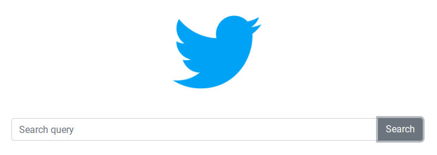

# Recuperación de Documentos de Texto

## Integrantes

| Nombre y Apellidos |
|---|
|Diego Enciso Lozano |
|Luis Jauregui Vera	 |
|Jonathan Hoyos      |

## Tabla de contenido

"Clic para navegar: "

- [Introducción](#Introducción)
- [Fundamentos y descripción de las técnicas](#Fundamentos-y-descripción-de-las-técnicas)
- [Resultados experimentales](#Resultados-experimentales)
- [Pruebas de uso y presentación](#Pruebas-de-uso-y-presentación)

## Introducción

Este proyecto consiste en entender y aplicar algoritmos de busqueda y recuperación de la información basada en el contenido.
Para esto, se construye un indice invertido óptimo para tareas de busqueda y recuperación en documentos de texto que se encuentran en memoria secundaria.
Los datos se han utilizando son de un conjunto de tweets en formato json. Solo se contarán los tweets originales y no retweets.

En el informe se muestra las comparaciones al usar queries con los mejores resultados.

## Fundamentos y descripción de las técnicas

### Backend

Se ha construido un indice invertido optimo para recuperación por ranking para consultas de texto libre.

Para esto, primero se lee todos los tweets que estan almacenados en formato json y sean del 2018,y se guarda a una lista de nombre tweets_files:

    def read_files(self):
    for base, dirs, files in os.walk(./):
      for file in files:
        f = join(base, file)
        if f.endswith(.json) and "tweets_2018-" in f:
          self.tweets_files.append(f)

#### Filtrar stopwords
Con la ayuda de la libreria *nltk* creamos los stopwords en español

    nltk.download('stopwords')
    stoplist = stopwords.words("spanish")
    stoplist += ['?','aqui','.',',','»','«','â','ã','>','<','(',')','º','u']

#### Reduccion de palabras(stemming)

Vamos a obtener la raiz de la palabra con ayuda de la libreria *SnowballStemmer* para el idioma español

    stemmer = SnowballStemmer('spanish')
    token = stemmer.stem(word)

#### Tokenización
Vamos a usar una funcion de limpieza que removerá caracteres especiales, signos de puntuación, emojis y urls para tener un tweet limpio.

    def clean_text(self, text):
        text = self.remove_special_character(text)
        text = self.remove_punctuation(text)
        text = self.remove_emoji(text)
        text = self.remove_url(text)
        text = nltk.word_tokenize(text)
    return text

 Finalmente, para obtener los tokens, vamos a recorrer todos los archivos de nuestra lista de tweets en  _tweets_files_ ,  vamos a guardar el texto en un _text_list_ y cada texto lo vamos a limpiar con nuestra función anterior. Con esto vamos a obtener los tokens y pasarlo al final por nuestro stoplist.

     for file in self.tweets_files:
          json_file = open(file, encoding = 'utf-8')
          text_list = [(e['text'],e['id']) for e in json.loads(json_file.read()) if not e["retweeted"]]
          json_file.close()
          for text in text_list:
            self.tweets_count += 1
            t = text[0]
            t = self.clean_text(t.lower())
            for word in t:
              if word not in stoplist:
                token = stemmer.stem(word)

## Resultados experimentales

### Consultas

### Nuestra consulta en lenguaje natural:
>El señor Daniel Urresti me bloqueo por cuestionar continuamente su candidatura

Cuadros para ver el desempeño de los indice invertidos:

 ##### Tiempos de ejecución

- Tiempos de cada test

    | Test   | Input  	 |  Tiempo (ms) |
    |------  |--------   |--------------|
    |  1     | 100       |              |
    |  2     | 500 	 |       	|
    |  3     | 1000 	 |        	|

**Discusión y Análisis**

Una de las conclusiones que obtuvimos es al momento de hacer una consulta con un nombre **Reggiardo**, como aparece en todos los archivos json, la norma tiende a ser 0.

## Pruebas de uso y presentación
Link del video de funcionalidad.[ Video de funcionalidad](https://drive.google.com/drive/folders/__________)
